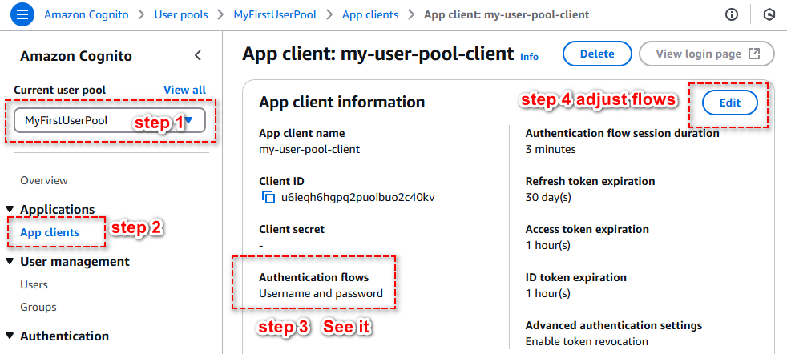
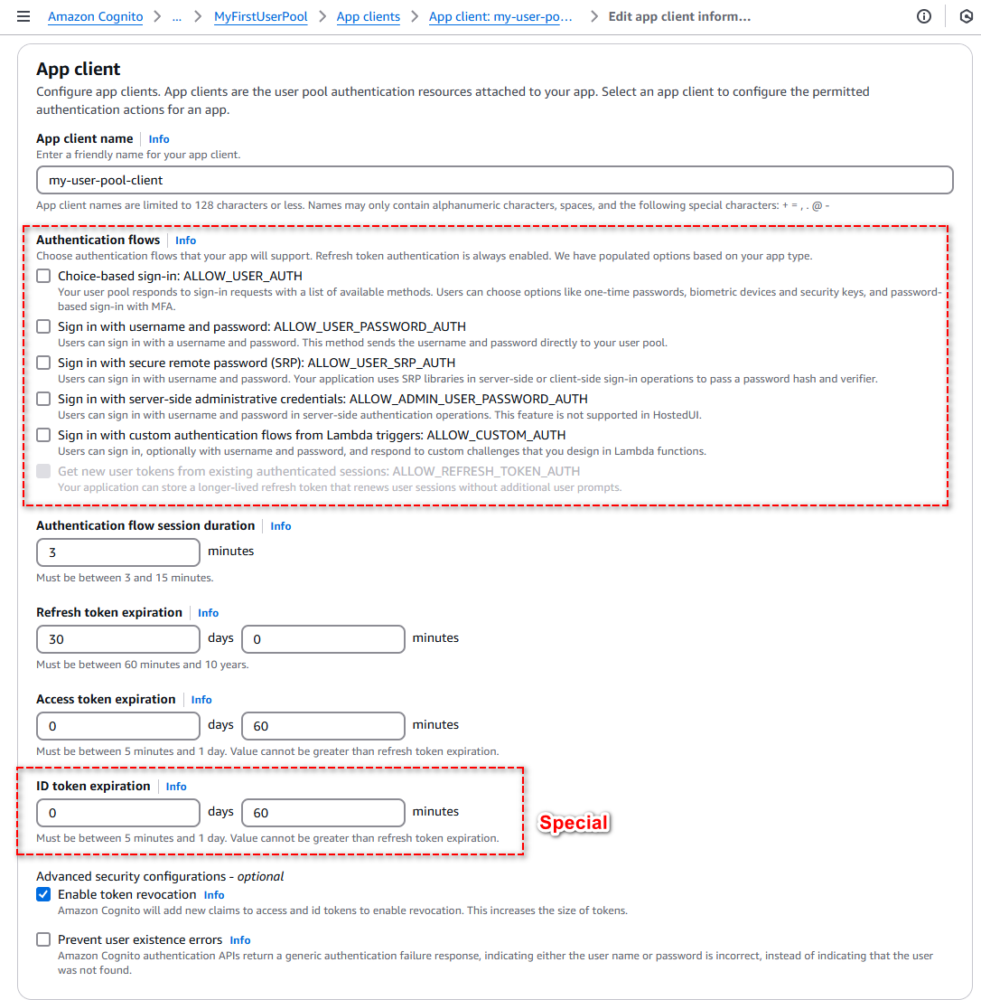

# Client-side authentication flow
In the previous recipe, we demonstrated the use of server-side authentication flow, along with the authentication flow type `ADMIN_NO_SRP_AUTH`. In this recipe, we will demonstrate the use of client-side authentication flow, with the authentication flow type `USER_PASSWORD_AUTH`.

## Getting ready
The following are the prerequisites for completing this recipe:

* Make sure that we have created a Cognito user pool, following the recipe [Creating a Cognito user pool](../creating-a-cognito-user-pool/README.md). 
## How to do it...
First, we will create the client, and then, we will execute various client-specific API commands, to demonstrate the client-side authentication flow.
### Creating a Cognito user pool client
We will create a user pool client for client-side authentication flow both using AWS CLI. We will also see the template components to use within a CloudFormation template.

#### Creating a Cognito user pool client with AWS CLI
We use the `cognito-idp create-user-pool-client` sub-command to create a user pool client, as follows:
```bash
aws cognito-idp create-user-pool-client \
    --user-pool-id ap-northeast-1_chDaVYGF3 \
    --client-name my-user-pool-client \
    --explicit-auth-flows USER_PASSWORD_AUTH \
    --profile admin

{
    "UserPoolClient": {
        "UserPoolId": "ap-northeast-1_chDaVYGF3",
        "ClientName": "my-user-pool-client",
        "ClientId": "4ssm8oh504j4q146ic4hogbo2s",
        "LastModifiedDate": "2024-11-22T15:11:02.702000+08:00",
        "CreationDate": "2024-11-22T15:11:02.702000+08:00",
        "RefreshTokenValidity": 30,
        "TokenValidityUnits": {},
        "ExplicitAuthFlows": [
            "USER_PASSWORD_AUTH"
        ],
        "AllowedOAuthFlowsUserPoolClient": false,
        "EnableTokenRevocation": true,
        "EnablePropagateAdditionalUserContextData": false,
        "AuthSessionValidity": 3
    }
}    
```
Here, I have specified `USER_PASSWORD_AUTH` as an explicit `auth` flow.
 
> `ADMIN_NO_SRP_AUTH` is only supported with the admin-initiated authentication used in the `server-side authentication flow`. 

  
Both `ADMIN_NO_SRP_AUTH` and `USER_PASSWORD_AUTH` allow us to pass our username and password without SRP, but `USER_PASSWORD_AUTH` also supports user migration from legacy applications. 


#### Creating a Cognito user pool client with CloudFormation template
We will follow the AWS CLI command option to create the corresponding CloudFormation template, in order to create the app client.

The `Resources` and `Outputs` sections should look as follows:
```yaml
Resources:
  MyUserPoolClient:
    Type: AWS::Cognito::UserPoolClient
    Properties:
      ClientName: 'My Cognito User Pool Client'
      ExplicitAuthFlows:
      -USER_PASSWORD_AUTH
      RefreshTokenValidity: 30
      UserPoolId: !ImportValue MyFirstUserPoolId
Outputs:
  ClientId:
    Description: 'Cognito user pool Client'
    Value: !Ref MyUserPoolClient
```    
We can also add a template format version and a description.

We can now create the CloudFormation stack with the user pool client, by executing the `aws cloudformation create-stack` command. 

### Client-side authentication flow
As we discussed previously, the client-side authentication flow uses `non-admin APIs`.

> The output for most of the commands will be similar to the ones that we discussed in the recipe Server-side authentication flow, and need not be repeated here. Please refer to that recipe for the screenshots. 

Follow the steps to demonstrate the client-side authentication flow. Remember to replace the `user-pool-id` value with your user pool id.

1. For creating the user, we will still use the admin APIs, as follows:
   ```bash
    aws cognito-idp admin-create-user \
        --user-pool-id ap-northeast-1_chDaVYGF3  \
        --username testuser2 \
        --temporary-password Passw0rd$ \
        --profile admin

    {
        "User": {
            "Username": "testuser2",
            "Attributes": [
                {
                    "Name": "sub",
                    "Value": "f7d44aa8-30f1-700d-19d0-9cbbe536f3a3"
                }
            ],
            "UserCreateDate": "2024-11-22T15:23:06.305000+08:00",
            "UserLastModifiedDate": "2024-11-22T15:23:06.305000+08:00",
            "Enabled": true,
            "UserStatus": "FORCE_CHANGE_PASSWORD"
        }
    }     
   ```
   The default user status will be `FORCE_CHANGE_PASSWORD`, as we saw in [the previous recipe](../cognito-server-side-authentication-flow/README.md#server-side-authentication-flow).
2. Initiate the authentication flow ( use `aws cognito-idp initiate-auth` ), as follows:
    ```bash
    aws cognito-idp initiate-auth \
        --client-id 4ssm8oh504j4q146ic4hogbo2s \
        --auth-flow USER_PASSWORD_AUTH \
        --auth-parameters USERNAME=testuser2,PASSWORD=Passw0rd$

    {
        "ChallengeName": "NEW_PASSWORD_REQUIRED",
        "Session": "AYABeEs2OQ_pIWFy19gpB90UWxEAHQABAAdTZXJ2aWNlABBDb2duaXRvVXNlclBvb2xzAAEAB2F3cy1rbXMAUGFybjphd3M6a21zOmFwLW5vcnRoZWFzdC0xOjM0NjM3NzU0NDkyNzprZXkvZDNhY2NlYmQtNTdhOC00NWE0LTk1ZmEtYzc2YzY5ZDIwYTRkALgBAgEAeBE2TfZ_8ma_gHZ_GQQsBbrCXyeeUzL6X63Mn4L5d8v0AWw0JS3_D4FD4NLTinCtDyoAAAB-MHwGCSqGSIb3DQEHBqBvMG0CAQAwaAYJKoZIhvcNAQcBMB4GCWCGSAFlAwQBLjARBAxaREv9qq7SGDGr6FECARCAO6AjWYCoHMUSQ2cHTDD67Vp0xJvMSQv28xSIU1T6OQtff-3mS39CUO-Ndn7o5R2A6SDSzjXxpv8kFir1AgAAAAAMAAAQAAAAAAAAAAAAAAAAACiNtG-jMK3flfTBw_4I4_n_____AAAAAQAAAAAAAAAAAAAAAQAAANWWC2_n98EbJC68K1uiewnifL-0oNk05LmOfxyJCx3AoUGIwaMHkNjnlVq7Hky4Mw_klhk_kgSyFZSG_bfr6BXQ1oDFM-eOrqMfA9IXELbGk0A9YCYIaD8g4n2ngpVW99N76sHTSPpRSBBeTnNrrZZzn5CftNF1DNNGQ9L7RNbivOjdSFDERUd7Gby33rvtdk57qJuGa-u4GtnFzh4KesqIsQYJ9W1RIB1cpiRbYU5U2ZDIYEsWMh0I_c_AkA2cs6I8pog0wh20yvMyv7aMaWhDxH59ZOaJexgFK97GVYJkNByQa7Oh",
        "ChallengeParameters": {
            "USER_ID_FOR_SRP": "testuser2",
            "requiredAttributes": "[]",
            "userAttributes": "{}"
        }
    }   
    ```
    > As this is a non-admin API, we do not have to specify the admin profile from the command line. The `initiate auth` command will return a `NEW_PASSWORD_REQUIRED` challenge and a `session ID`.
3. Send a response to the `auth` challenge(use `aws cognito-idp respond-to-auth-challenge`), as follows:
    ```bash
    aws cognito-idp respond-to-auth-challenge \
        --client-id 4ssm8oh504j4q146ic4hogbo2s \
        --challenge-name NEW_PASSWORD_REQUIRED \
        --challenge-responses USERNAME=testuser2,NEW_PASSWORD=NewPass0123$ \
        --session <session-id>

    {
        "ChallengeParameters": {},
        "AuthenticationResult": {
            "AccessToken": "<jwt..ommitted...>",
            "ExpiresIn": 3600,
            "TokenType": "Bearer",
            "RefreshToken": "<jwt..ommitted...>",
            "IdToken": "<jwt..ommitted...>"
        }
    }
    ```
    If it is successful, this command will return a response with three tokens: an access token, a refresh token, and an ID token. We can try to run the `initiate auth` command with the new password, and check that it does not ask for the password challenge.
4. From now on, we can also use the refresh token to regenerate the access token and the ID token:
    ```bash
    aws cognito-idp initiate-auth \
        --client-id 4ssm8oh504j4q146ic4hogbo2s \
        --auth-flow REFRESH_TOKEN_AUTH \
        --auth-parameters REFRESH_TOKEN=<refresh token>

    {
        "ChallengeParameters": {},
        "AuthenticationResult": {
            "AccessToken": "<jwt..ommitted...>",
            "ExpiresIn": 3600,
            "TokenType": "Bearer",
            "IdToken": "<jwt..ommitted...>"
        }
    }

    ```
5. To clean up, delete the user pool client, as follows:
    ```bash
    aws cognito-idp delete-user-pool-client \
        --user-pool-id ap-northeast-1_chDaVYGF3  \
        --client-id 4ssm8oh504j4q146ic4hogbo2s \
        --profile admin
    ```
    Delete the user that we created for this recipe, as follows:
    ```bash
    aws cognito-idp admin-delete-user \
        --user-pool-id ap-northeast-1_chDaVYGF3  \
        --username testuser2 \
        --profile admin
    ```     
## How it works...
To summarize, we did the following in this recipe:
1. Created a user
2. Initiated authentication flow as a user
3. Responded to password challenges from Cognito
4. Used the refresh token to regenerate the access token and the ID token

The major differences, as compared to the server-side authentication flow API usage, are as follows:
1. Unlike with the server-side authentication APIs, we did not specify an admin profile while executing the CLI commands.
2. You do not have to specify the user pool ID with client-side authentication flow API calls; only the client ID needs to be specified.
> In real-world applications, you generally choose client-side authentication if you are working with SDKs for client-side platforms (for example, iOS, Android, or JavaScript), and server-side authentication flows if you are working with SDKs for server-side language platforms (for example, Java and Node.js).     

## There's more...
In this recipe, we used a simple authentication flow type, based on a username and password. However, you can also utilize the additional security of Secure Remote Password protocol for additional security. Currently, SRP support is only available for the iOS, Android, and JavaScript SDKs. 

We explored the use of server-side authentication flow and client-side authentication flow in the last two recipes. There are additional flows, such as the custom authentication flow and the user migration authentication flow. You can refer to the link to `Amazon Cognito User Pool Authentication Flow` provided in the `See also` section. 

## See also
https://docs.aws.amazon.com/cognito/latest/developerguide/amazon-cognito-user-pools-authentication-flow.html