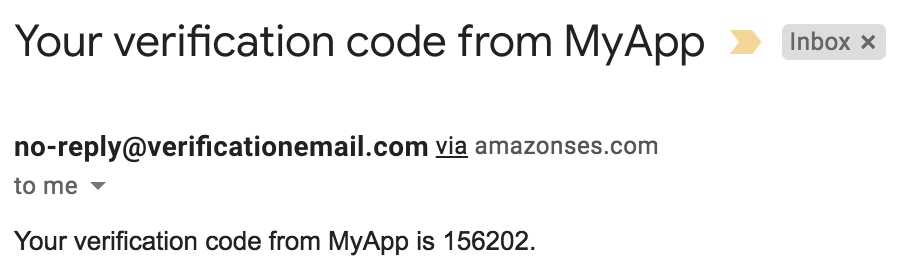

# User sign-up flow with Cognito
In the previous recipes, we created our users as admins. However, many real-world applications, including most web applications, allow users to sign-up by themselves. During the sign-up, a user might have to verify their email or phone number. An admin might also confirm a user sign-up.

In this recipe, we will demonstrate the user sign-up flow with self-confirmation, as well as with admin confirmation, using CLI commands. You can follow the same steps while working with any SDK of your choice. You can refer to the documentation of the particular SDK for the exact usage. 

## Getting ready
The following are the prerequisites for completing this recipe:
* Ensure that you have created a Cognito user pool, following the recipe [`Creating a Cognito user pool`](../creating-a-cognito-user-pool/README.md). 
* Ensure that you have created a Cognito app client with a `USER_PASSWORD_AUTH` explicit flow declaration, following the recipe [`Client-side authentication`](../cognito-client-side-authentication-flow/README.md). 


## How to do it...
I will discuss two sign-up flows: one that requires the user to provide an email address and confirm sign-up based on a code received in their email, and one in which the admin will confirm the user. In real-world applications, these two are often combined.

### User sign-up with self-confirmation
The following steps describe how to set up user sign-up with self-confirmation:
1. Use the `sign-up` sub-command to initiate the sign-up flow, providing your `username` and `password`:
    ```bash
    aws cognito-idp sign-up \
        --client-id 1vbdpbk913s51irajrvctql7nu \
        --username testuser4 \
        --password Passw0rd$ \
        --user-attributes Name=email,Value=testemail@heartin.tech
    ```    
    Replace `testemail@heartin.tech` with your email address. 

    If this is successful, you should get the following response:
    ```json
    {
        "UserConfirmed": false,
        "CodeDeliveryDetails": {
            "Destination": "r***@g***",
            "DeliveryMedium": "EMAIL",
            "AttributeName": "email"
        },
        "UserSub": "67c4eaa8-2091-70f9-f1e9-ff5016015172"
    }
    ```
    You will also receive an email with the confirmation code, as shown in the following screenshot:
    
    > The preceding message format was configured while creating the user pool. You can also use the email configuration section in the input CLI JSON, or within the CloudFormation template, to make additional customizations, such as a reply email address.
2. Confirm the user sign-up with the code received, as follows:
    ```bash
    aws cognito-idp confirm-sign-up \
    --client-id 1vbdpbk913s51irajrvctql7nu \
    --username testuser4 \
    --confirmation-code 156202
    ```
    If it is successful, you should see no errors in the response.
3. Now, try to sign-in with your username and password, as follows:
    ```bash
    aws cognito-idp initiate-auth \
        --client-id 1vbdpbk913s51irajrvctql7nu \
        --auth-flow USER_PASSWORD_AUTH \
        --auth-parameters USERNAME=testuser4,PASSWORD=Passw0rd$
    ```
    If it is successful, you will get a response with the `AccessToken`, `RefreshToken`, and `IdToken`:
    ```json 
    {
        "ChallengeParameters": {},
        "AuthenticationResult": {
            "AccessToken": "eyJraWQiOiJvbjJMb2FxeGhhbTlSTUhGXC84R01cLytOQU9JdWt6SGI1RStRVnFoeHFLb3c9IiwiYWxnIjoiUlMyNTYifQ.eyJzdWIiOiI2N2M0ZWFhOC0yMDkxLTcwZjktZjFlOS1mZjUwMTYwMTUxNzIiLCJpc3MiOiJodHRwczpcL1wvY29nbml0by1pZHAuYXAtbm9ydGhlYXN0LTEuYW1hem9uYXdzLmNvbVwvYXAtbm9ydGhlYXN0LTFfTmJEZklrUHhtIiwiY2xpZW50X2lkIjoiMXZiZHBiazkxM3M1MWlyYWpydmN0cWw3bnUiLCJvcmlnaW5fanRpIjoiNjU4NGJiNjAtODllZi00M2Q4LTk3YjktNTQ2MjM2MDg0NWJjIiwiZXZlbnRfaWQiOiIyMTY0YjRkYS0yNWJiLTRhMTYtYWFmOS0wOWE0OTllMjA0YmUiLCJ0b2tlbl91c2UiOiJhY2Nlc3MiLCJzY29wZSI6ImF3cy5jb2duaXRvLnNpZ25pbi51c2VyLmFkbWluIiwiYXV0aF90aW1lIjoxNzMyMjY2MDcwLCJleHAiOjE3MzIyNjk2NzAsImlhdCI6MTczMjI2NjA3MCwianRpIjoiZThlYmM4ZjgtNTYyYi00YTk0LWI1NDUtNzYwMzAyN2IwMWU5IiwidXNlcm5hbWUiOiJ0ZXN0dXNlcjQifQ.uUGBCIoAxWb-_bRi8_2LLxSFZAntwKTigqj_PYQutPy-yy0Z8MHUp3jSkz6ndiyfK9dHW6WyyOaPx4KDdZfOd5HgS14bXcJOK_pFzvTaX5U6H5dCRi6wc-bunmpYVVDk1V7S4oU4LQBvJ41Av_bRBCmWRmNslDjTUmMiwqRSsKu1ZUojDAghMsBa6Mi1Z7prv5wL0w6uNmbUgam-aUpsyRiT4oIk9CHQ55829-CcVTO9BHDBU2hcppoBEjTvmfy8kU_3rmSzoivWs8fFJ013vuOeK5-2Y7UUrGs1w-PS3qiN8MshEB-jNI7wp4jAanLSg3l5UTHrLPtWJZfiDOm2pA",
            "ExpiresIn": 3600,
            "TokenType": "Bearer",
            "RefreshToken": "eyJjdHkiOiJKV1QiLCJlbmMiOiJBMjU2R0NNIiwiYWxnIjoiUlNBLU9BRVAifQ.Saj8OXMh9aE645g8FHPkeG89hiemWV4IpEg5BhL7fzijVZllA4_owGVoTtHmxWA5oQGdjegvk8EmmOga3Yo_u7moXT0xXeLKVUldSa0M_uARyoH60Y6K2NiedWxOfHqjWHpwluCmSO8i3rjC-4pReLYAFVeaQvSkfPWi9WVqQWGoe8obF8VGA0F609gwPMnSLStlZjqXRBuHDMt14Q8GxMv3xU2esB4ISfgzoGpfBgUhkHdKBirCYKM0gLc7FH12p5O0HmnGflj7vBFyvs_eUepDsRIiT8B60VZ7RzDMJIB5FABBaeySBDZysqVfch8il8QeDoBDqbp1xY9Cm-N-Rw.MFBJGwXGPIKgydn-.of9MPmzw8SrO6kSVJACoX2gGtlBapWIvb03_zM0MsuXrjLSeo_x7VG8UIJNI_neB5OISIVBoSKBgbvAb4VTwsnRdLoRnGkhp8WdF_FMzHkByXy-6MRj46DjEThkC4lGQbSsXdSGwFKd40e1koiTMq9gFfoYrn6KCzZyemDg_asaO9Tc42rgbDUmj_fwjEos6gmBVJzlICCmqNu-1ZYpy6lALCBcYnA6yxOGQAnrl0op849Q2a_xTIENnMxbOC9wvEl_FE7FFlm7xSjwSFEcNLBtVXSxHejmnPoODvPfO-c5ansSbrUwIYPaxvIiOgD57JYjla0rGH0G6d5vPhW6GQpL686Ve8kMAKjeVAXymmG6j9H3oDv9RSKYFDMwVpNmmv72WwF7hCVXj57HRe8aGgy7t_Zrtv52-k-pp3NOfQjmA62dDaqvpwd9ZMnr9bXoTgVSlt-nLSiyn3o_6rPwvhsP5jZbp54hwHiFn4vmskd4JMeTVgerlf5KiW-nWn09tyI5z3r1Tg0BSaD0m6liPW6wpR82EDblsRqIUAaexgw5vieJi-YWZ4SO2GJN2C1Lu-j3uMRGCL0g1_lYYz6-Bm21rG9a_lkGr9Mn5PoKKmfvkCrNJN7eVDNbHsyNMZUr260teQW59biseie8xvnD5gXlAx4XiE2kPPxf2vBj_cZh31zb39GduO6CSofj5sg9fznNru-68ASOmdNLuOJ0vKr01NOCXdddMfHFkHPTEW6wtGTs-79lPc9qax8T16O30xk4kFKDa28w8Hx5G2kjW-k7rK8SCP5opn8OWint2MNQpo0WlbsmMz-hQ1Y7Yey8vaEmAe0_GvsjwzTLtX83_S2wfVbK1rZ9964VECGlAQPMIAMze2LvCpFFrwH_hIEOMHkQS920lV7IjXePW24fbWFA4U5ddbwucqihRiIQA3GiFfTk3qYkGylFLc2wZ52JmotZOYWHlYT06cFohoJkkziPjAC1fXge-Op8uIpZHu6dFp3iRLIfxSES6NI_vuBgtY0gUkNqJgDpt-C00jiTKT-hNDXr-qOmkK3t7hIuzetBAzEIgwXppy-jSuE8J8JIzyqjljYanMoJ0RC06ghGeMeFktZcSSENxeFu15G0UWv_aT4gIwkj0dpuQlG37Vxa9qgSeWiY7EUXo-KZsBKEjEC40-f2gcfM2Yo1vxMxXyF-xq01IKf0vIwlBaTQlo4Lze7C6mh7y-g--F8vZmbglZt3LLtkAmwppXeLYJ5pZaAIeXw3QSX9buAqFezLHOR2L6Jana0OqFqxOt7ETMiDlWb4T_ZOC.jTYoyUvWjQZZkYs3Rqp3vQ",
            "IdToken": "eyJraWQiOiJROHJoS3ZzSEVYSG5HaVVHVGQ2M3pnbE9IOE55QVYzdlRGUWdGdmhsc3ZRPSIsImFsZyI6IlJTMjU2In0.eyJzdWIiOiI2N2M0ZWFhOC0yMDkxLTcwZjktZjFlOS1mZjUwMTYwMTUxNzIiLCJlbWFpbF92ZXJpZmllZCI6dHJ1ZSwiaXNzIjoiaHR0cHM6XC9cL2NvZ25pdG8taWRwLmFwLW5vcnRoZWFzdC0xLmFtYXpvbmF3cy5jb21cL2FwLW5vcnRoZWFzdC0xX05iRGZJa1B4bSIsImNvZ25pdG86dXNlcm5hbWUiOiJ0ZXN0dXNlcjQiLCJvcmlnaW5fanRpIjoiNjU4NGJiNjAtODllZi00M2Q4LTk3YjktNTQ2MjM2MDg0NWJjIiwiYXVkIjoiMXZiZHBiazkxM3M1MWlyYWpydmN0cWw3bnUiLCJldmVudF9pZCI6IjIxNjRiNGRhLTI1YmItNGExNi1hYWY5LTA5YTQ5OWUyMDRiZSIsInRva2VuX3VzZSI6ImlkIiwiYXV0aF90aW1lIjoxNzMyMjY2MDcwLCJleHAiOjE3MzIyNjk2NzAsImlhdCI6MTczMjI2NjA3MCwianRpIjoiNWNkYmVhN2ItMmJjOC00OWZkLWE0MjUtNDVkOTI2NTNiMWQ1IiwiZW1haWwiOiJyb2JlcnQwNzE0QGdtYWlsLmNvbSJ9.YAIfowpzLdzDRQA6NhyMSjtpNjbZXpdBybYxPUvOzUw8Xfr0UBlFgXMmptehovnNJ5lQjGAnxMaHK74DVW7VaXam5VZkynd4bxz64Zz48dVlzD5LwIV8iyKgCQOfBWBuQobQuOpBJxduGwkA0EqBZXMkewRAQKiI731KFyc7SLZHOzETj32dn83gEsuc5oEr-23MLRGS_QF8arPOeJJz7HL4B0NnqRUtKj2xmxvBPIX5Tl6ZEXU5qWivuKlucBl8RFvXHLL99c6RV8BbW9v5JfqepA5AoUsvFnWAa5MZasD1ZO9N9BdJNQYCD-56eBrm4zg-xHxFUUKQ1Dk3_I_uSw"
        }
    }
    ```
4. Use the access token to delete the user, as follows:
    ```bash
    aws cognito-idp delete-user \
        --access-token <access token>
    ```    
    Replace the `AccessToken` with the access token received in the previous command response. If it is successful, you should see no response.
5. Verify that the user was actually deleted by trying to initiate the authentication flow again. This time, you should get an error that the user does not exist.

### User sign-up with admin confirmation
User sign-up with admin confirmation is similar to self-confirmation, as indicated by the following steps:
1. Use the `sign-up` sub-command to initiate the `sign-up` flow, as follows:
    ```bash
    aws cognito-idp sign-up \
        --client-id 1vbdpbk913s51irajrvctql7nu \
        --username testuser4 \
        --password Passw0rd$
    ```
    The email is optional here, since the user will be confirmed by an admin. However, you may specify an email and it will send the verification code, as we had specified the email as an `AutoVerifiedAttributes` while creating the user pool.
    
    If this is successful, you should get the following response:
    ```json
    {
        "UserConfirmed": false,
        "UserSub": "e9ff2a2a-f7d9-44d3-b5a3-24ef7ee5288a"
    }
    ```
2. Confirm the user as an admin, as follows:
    ```bash
    aws cognito-idp admin-confirm-sign-up \
        --user-pool-id us-east-1_fYsb1Gyec \
        --username testuser4 \
        --profile admin
    ```    
    If this is successful, you should not see a response.
3. Now, try to sign-in with your username and password, as follows:
    ```bash
    aws cognito-idp initiate-auth \
        --client-id 1vbdpbk913s51irajrvctql7nu \
        --auth-flow USER_PASSWORD_AUTH \
        --auth-parameters USERNAME=testuser4,PASSWORD=Passw0rd$
    ```
    If it is successful, you will get a response with the `AccessToken`, `RefreshToken`, and `IdToken`, similar to the one in the self-confirmation flow.

4. You can delete the user by using the `delete-user` sub-command (refer to the self-confirmation flow).

## How it works...
We have discussed two flows for user sign-up. In the first flow, the user provided an email while signing up, and an email was sent with a passcode. The user then used this passcode to confirm the sign-up process. In the second flow, the user created an account without providing an email, and then an admin confirmed the user. In the second flow, the user can still provide email; in such cases, the user will get the passcode, and an admin can still confirm that user. Most real-world projects support both of these options in a single flow. 

## There's more...
We have discussed passing an email as a user attribute. You can also pass any of the other built-in user attributes, such as name, given_name, family_name, middle_name, nick_name, preferred_username, profile, picture, website, email, email_verified, gender, birthdate, zoneinfo, locale, phone_number, phone_number_verified, address, and updated_at. You can also define a custom attribute.

We only discussed email verification in this recipe. You can add phone verification by adding it to the `AutoVerifiedAttributes` list. We also did user `sign-up` with a text username. We could have also used an `email` or `phone_number` as usernames. In a later recipe, we will create a user pool to support SMS and MFA verification, and to support user sign-up with a phone_number as a username.

## See also
https://docs.aws.amazon.com/cognito/latest/developerguide/user-pool-settings-email-phone-verification.html