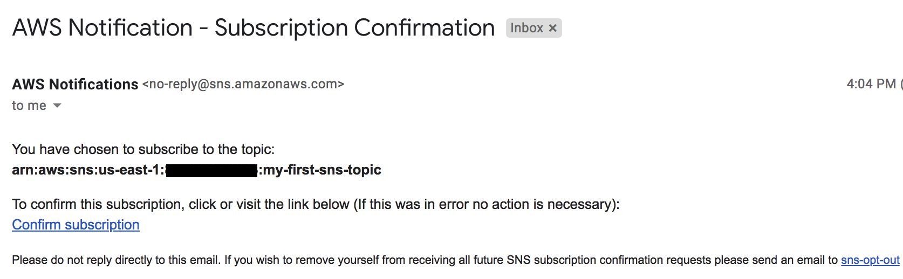

# Your first SNS topic for email and SMS (AWS CLI + CloudFormation)
In this recipe, we will create a **Simple Notification Service (SNS)** topic for both email and SMS subscriptions. In the real world, you may use this for features such as **one time passwords (OTP)**. We had already indirectly used SNS when we used SMS verification in Chapter 4, [Application Security with Amazon Cognito](../../Chapter04/README.md).


## Getting ready
The following are the prerequisites for this recipe:
* A working phone number and email address.

## How to do it...
We will first create an SNS topic and then test email and SMS subscriptions.

## Creating an SNS topic
We will create an SNS topic using both CLI commands and a CloudFormation template.

### AWS CLI 
You can create an SNS topic using the `aws sns create-topic` command:
```bash
aws sns create-topic \
    --name my-first-sns-topic \
    --profile admin
```    
If successful, this will return the SNS topic ARN:
```json
{
    "TopicArn": "arn:aws:sns:ap-northeast-1:937197674655:my-first-sns-topic"
}
```

### The CloudFormation template
The `Resources` and `Output` sections of the template can include following:
```yaml
Resources:
  SNSTopic:
    Type: AWS::SNS::Topic
    Properties:
      DisplayName: 'My first SNS topic'
      TopicName: my-first-sns-topic-cf

Output:
  SNSTopicARN:
    Value: !Ref SNSTopic
    Export:
      Name: "SNSTopicARN"
  SNSTopicName:
    Value: !GetAtt SNSTopic.TopicName
    Export:
      Name: "SNSTopicName"
```      
You can also specify a list of subscriptions. However, in general practice subscriptions are added dynamically and hence we will demonstrate them using AWS CLI commands. You may also include a template format version and a description in the template file.

If the create stack command completes successfully, the stack description command's output will contain an `Output` section, as follows:
```json
{
    "Stacks": [
        {
            "StackId": "arn:aws:cloudformation:ap-northeast-1:937197674655:stack/snsfirststack/bf439160-b0aa-11ef-93c7-0e0565788137",
            "StackName": "snsfirststack",
            "Description": "My first SNS topic",
            "CreationTime": "2024-12-02T12:41:27.224000+00:00",
            "RollbackConfiguration": {},
            "StackStatus": "CREATE_COMPLETE",
            "DisableRollback": false,
            "NotificationARNs": [],
            "Outputs": [
                {
                    "OutputKey": "SNSTopicARN",
                    "OutputValue": "arn:aws:sns:ap-northeast-1:937197674655:my-first-sns-topic-cf",
                    "ExportName": "SNSTopicARN"
                },
                {
                    "OutputKey": "SNSTopicName",
                    "OutputValue": "my-first-sns-topic-cf",
                    "ExportName": "SNSTopicName"
                }
            ],
            "Tags": [],
            "EnableTerminationProtection": false,
            "DriftInformation": {
                "StackDriftStatus": "NOT_CHECKED"
            }
        }
    ]
}
```

## Creating email and SMS subscriptions (AWS CLI)
We will create both SMS and email subscriptions.


### SMS subscription
We can create an SMS subscription, as follows:
```bash
aws sns subscribe \
    --topic-arn arn:aws:sns:ap-northeast-1:<account id>:my-first-sns-topic \
    --protocol sms \
    --notification-endpoint +886920301309  \
    --profile admin
```    
If successful, this will return the Subscription ARN:
```json
{
    "SubscriptionArn": "arn:aws:sns:ap-northeast-1:937197674655:my-first-sns-topic:02955fc2-0d37-41b6-be17-11f6f722869f"
}
```
### Email subscription 
You can create an email subscription as follows:
```bash
aws sns subscribe \
    --topic-arn arn:aws:sns:ap-northeast-1:<account id>:my-first-sns-topic \
    --protocol email \
    --notification-endpoint robert0714@gmail.com \
    --profile admin
```

With email, the subscription ARN will not be confirmed until the user validates the subscription:
```json
{
    "SubscriptionArn": "pending confirmation"
}
```
You will now get an email for confirmation of the specified email address:


Once you click on Confirm subscription, you will be taken to a confirmation page:   

### Publishing a message
You can publish a message to the topic as follows:
```bash
aws sns publish \
 --topic-arn arn:aws:sns:us-east-1:<account id>:my-first-sns-topic \
 --message "sending message to both mobile and email" \
 --profile admin

{
    "MessageId": "139a3493-b7ea-5cb9-a1a3-6b540480f18d"
}
```
This will return the message ID in the console immediately. Actual delivery of the message to subscribers may take some time. 

The email message received will look as shown here. Similarly, you will also get an SMS:   

## How it works...
In summary, we did the following in this recipe:
1. Created an SNS topic using AWS CLI command
2. Created an SNS topic with a CloudFormation template
3. Created an SMS subscription
4. Created an email subscription
5. Published a message to the topic

## There's more...
We saw how to send an SMS and email to subscribers using SNS. SNS may be also used to fanout messages to a large number of subscribers by using SQS queues, AWS Lambda functions, and HTTP/S webhooks. We will see the fanout pattern with SNS and SQS in Chapter 9, [Serverless Architecture Patterns and Practices](../../Chapter09/).

## See also
* https://docs.aws.amazon.com/cli/latest/reference/sns/index.html
* https://docs.aws.amazon.com/AWSCloudFormation/latest/UserGuide/aws-properties-sns-topic.html